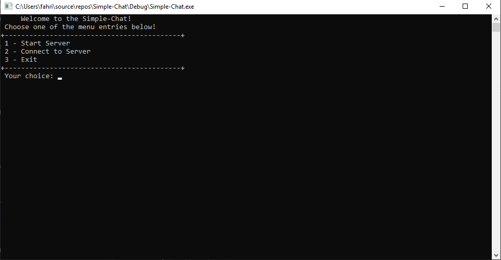
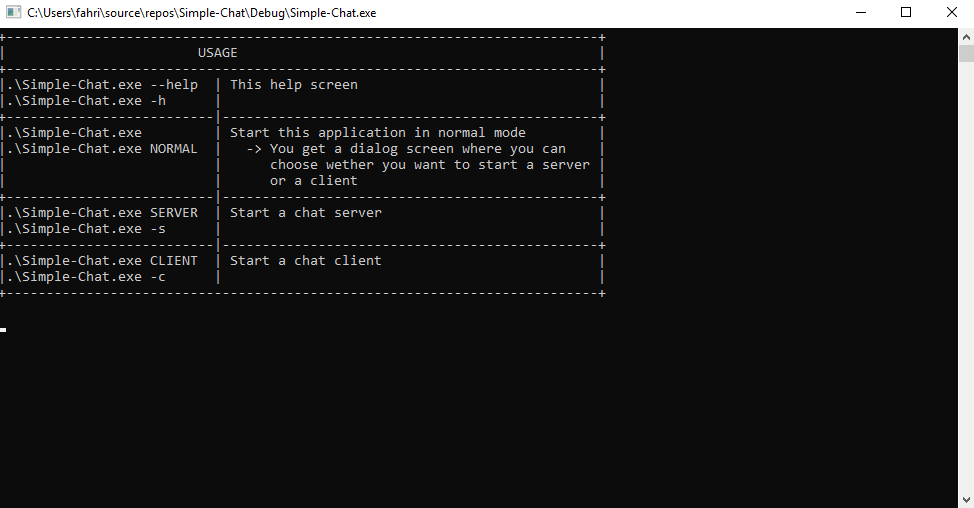

## Simple-Chat
This is a simple chat application. The Server and Client aren't implemented yet. The Server has only been implemented in the Sandbox yet. So you can start the Sandbox and connect via a client like "Putty". 
The Sockets will be implemented with the Winsock library. That means that this program is unfortunately Windows exclusive.

## Usage
### Main program
If you start the program, you will be greeted with a menu like this:

Then you can select wether you want to start a server or a client. Unfortunatly both don't do anything fancy yet. 

### Getting Help
If you just want help, then start the program with the command line argument "--help" or "-h". The following menu will be printed on the console:

## Disclaimer
**Please do not use this program outside your local area network. This program isn't safe at all and was only made for educational purposes!!**

## How it works
### General
For creating the sockets I have chosen the Winsock library. The connection type is TCP and only IPv4 is supported.

### Server
If you choose to start a server, the program will spawn a server on your PC. It will listen for incoming connections and it will inform you about these connection. Also all message received will be echoed to other clients.
If you want to use this server over the Internet, you have to manually port forward you machine. **But I highly discourage you to do so!! This server isn't safe at all. I have just made it for fun and for educational purposes**

### Client
If you choose to start a client, you will be lead through a small menu, where you have to input port and IP-Address of the server you want to connect to. After that you will be able to chat with all people who are also connected to this specific server.

## What I've learned
- Dealing with Winsock
